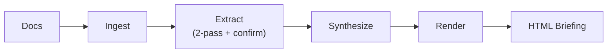
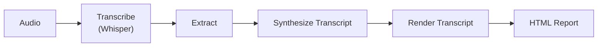

# synthesis

Point it at a folder of documents for an interactive HTML briefing, or use live transcription mode to capture lectures and meetings into a structured transcript report.


## Pipelines

**Document mode** — point it at a folder of docs and get a strategic HTML briefing:



**Live / Transcript mode** — capture a lecture or meeting and get a structured report:



## Quick Start

```bash
# 1. Install dependencies
pip install pyyaml httpx --break-system-packages

# 2. Set your API key
export ANTHROPIC_API_KEY=sk-ant-...

# 3. Edit config.yaml with your doc paths (see Config section below)

# 4. Run
python3 run.py
```

<details>
<summary><strong>How it works</strong></summary>

There are two pipeline paths depending on the mode.

**Document mode** (`--generate`): `ingest → extract → synthesize → render` — produces a Strategic Briefing.

**Ingest** walks through all configured paths and reads everything it can. PDFs go through `pdftotext`, DOCX through `pandoc`, and anything that isn't binary gets read as plain text. It also supports cloning GitHub repos if you prefix the path with `github:user/repo`.

**Extract** takes the ingested documents, shards them into chunks and sends each one through a two-pass LLM extraction. The first pass pulls out items, the second pass re-reads the same document looking for anything the first pass missed. Then a separate confirmation pass runs independently, and only items that both passes agree on and that have a grounded source quote actually make it through. This is what keeps hallucinations out.

**Synthesize** collects all confirmed items and asks the LLM to produce a structured JSON briefing with a status summary, risk level, each item with its date and urgency and dependencies, a recommended action sequence, any blockers, and key rules or constraints from the documents. Past deadlines are assumed done unless the documents explicitly say otherwise, so it doesn't panic about things you've already handled.

**Render** takes that JSON and generates a self-contained HTML file with a vertical timeline where a TODAY line separates what's behind from what's ahead, expandable cards for each item, a game plan section and a collapsible drawer for context like rules and people. No frameworks and no build step, just open the file in a browser.

**Live/transcript mode** (`--live`, `--live-teams`): `transcribe → extract → synthesize_transcript → render_transcript` — produces a Transcript Report.

**Transcribe** captures audio in real time via faster-whisper (microphone or system loopback) and produces an in-memory transcript. No audio is ever written to disk.

**Synthesize Transcript** takes the extracted items and asks the LLM to produce a structured JSON transcript report with a summary, topics, key claims, speakers, and takeaways — oriented around what was said rather than what needs to be done.

**Render Transcript** takes that JSON and generates a self-contained HTML report with a summary section, topic cards, key claims, people, takeaways, and a collapsible full transcript.

</details>

## Config

```yaml
api_key_env: ANTHROPIC_API_KEY
model: claude-sonnet-4-20250514
shard_size: 75000

topics:
  - name: My Project
    paths:
      - /path/to/docs
      - github:user/repo
```

Each topic gets its own section in the briefing. You can add as many as you want and each one will be processed independently.

## Run

| Command | What it does |
|---|---|
| `python3 run.py` | Generate briefing and serve |
| `python3 run.py --generate` | Generate only |
| `python3 run.py --serve` | Serve existing `index.html` on `localhost:8899` |
| `python3 run.py --live` | Live mic transcription → report → serve |
| `python3 run.py --live-teams` | System audio loopback (Teams/Zoom/Meet) → report → serve |

<details>
<summary><strong>Live Transcription — setup, platform support, and config</strong></summary>

To use the real-time Whisper transcription mode you need a few extra dependencies.

**System prerequisites:**

```bash
# macOS
brew install portaudio

# Debian / Ubuntu
sudo apt install libportaudio2
```

**Python dependencies:**

```bash
pip install faster-whisper sounddevice numpy
```

`--live` opens the microphone, transcribes in real-time using [faster-whisper](https://github.com/SYSTRAN/faster-whisper), and feeds the result into the transcript pipeline `extract → synthesize_transcript → render_transcript`. No audio files are ever written to disk.

```
[Microphone] → LiveTranscriber → [in-memory transcript]
                                         |
                               extract → synthesize_transcript → render_transcript → index.html
```

On first run, faster-whisper will download the `large-v3` model (~3 GB). Subsequent runs reuse the cached model.

`--live-teams` captures **whatever audio your system is currently playing** instead of the microphone — so it picks up the lecturer's voice directly from Teams, Zoom, or any other app, without any manual device selection.

```
[System audio output] → loopback → LiveTranscriber → [in-memory transcript]
                                                               |
                                               extract → synthesize_transcript → render_transcript → index.html
```

| Mode | Command | Audio source |
|---|---|---|
| In-person lecture | `python run.py --live` | Microphone |
| Teams / Zoom / Meet | `python run.py --live-teams` | System audio output (loopback) |

### Platform support

| OS | How it works | Setup required |
|---|---|---|
| **Windows** | WASAPI loopback on the default output device | None — works out of the box |
| **Linux** | PulseAudio/PipeWire monitor source (auto-detected) | None — works out of the box |
| **macOS** | Scans for BlackHole or similar virtual audio cable | `brew install blackhole-2ch` (one time) |

**macOS one-time setup:**

1. `brew install blackhole-2ch`
2. Open **Audio MIDI Setup** (Spotlight → "Audio MIDI Setup")
3. Click **+** → **Create Multi-Output Device** → check both your speakers and **BlackHole 2ch**
4. Set the Multi-Output Device as your system output in System Settings → Sound
5. Run `python3 run.py --live-teams` — BlackHole is auto-detected, no config needed

The code scans all audio devices for names containing "blackhole", "loopback", or "virtual" on macOS, and "monitor" on Linux, so no `--device` flag or config entry is ever required.

**Config** (`config.yaml`):

```yaml
live:
  language: de              # BCP-47 language code; "de" covers Standard German and Swiss German
  initial_prompt: "Grüezi, hüt bespräche mer d'Vorlesig..."  # seeds the decoder with dialect vocabulary
  model_size: large-v3      # whisper model to use
  chunk_seconds: 15         # transcribe every N seconds of captured audio
  topic_name: "Live Lecture" # name used in the generated report
```

**Swiss German dialect support:** faster-whisper uses the `language: de` code for all German variants. Seeding the decoder with `initial_prompt` text written in Swiss German (e.g. `"Grüezi, hüt bespräche mer..."`) biases the model toward dialect-specific vocabulary and spelling, improving accuracy for Swiss German speakers.

**Privacy:** no audio is ever saved to disk. All audio is processed in memory and discarded once the transcript is produced.

</details>

<details>
<summary><strong>Cost</strong></summary>

Each topic with N document shards makes roughly 3N + 1 API calls since every shard goes through extract, re-extract and confirm, plus one synthesize call at the end. On Anthropic API Tier 1 you're limited to 8k output tokens per minute, so keep `workers = 1` in `extract.py` to avoid getting rate limited. The retry logic in `llm.py` handles 429s with exponential backoff if it does happen.

</details>

## Files

```
run.py         orchestrator
ingest.py      file walker and text extraction
extract.py     two-pass LLM extraction with confirmation
synthesize.py  synthesize() for document briefings; synthesize_transcript() for live transcript reports
render.py      render() for document briefings; render_transcript() for live transcript reports
llm.py         API client with credential scrubbing and retry
transcribe.py  real-time Whisper mic transcription (--live mode)
config.yaml    paths and settings
```

## License

MIT
