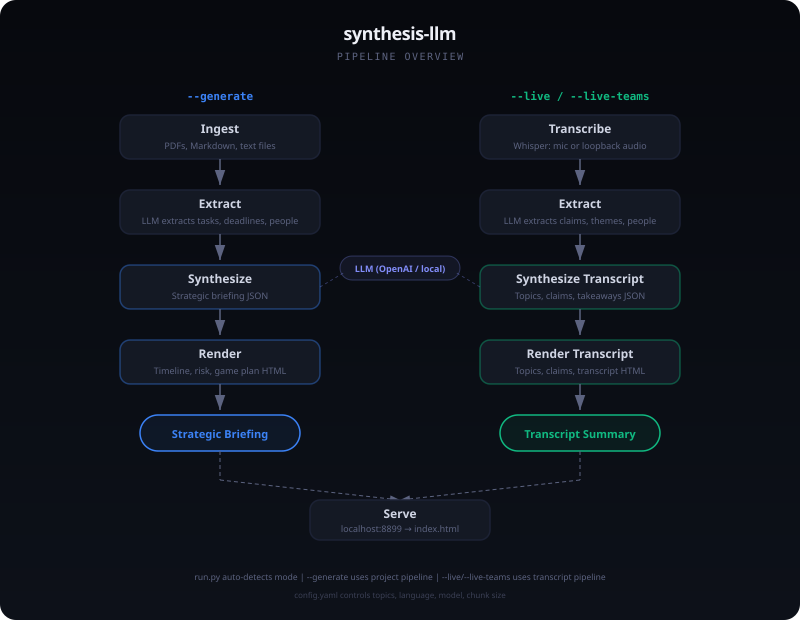

# synthesis

> Points at a folder of documents or a live audio stream and renders one self-contained HTML briefing grounded in source quotes.


synthesis reads a set of documents (or transcribes a lecture or meeting in real time), extracts the facts that matter through repeated LLM passes, and produces a single static HTML page that opens in any browser with no build step. It runs as a small Python program: the standard library HTTP server for serving, `httpx` against the Anthropic Messages API for the LLM calls, `pyyaml` for config, and optionally faster-whisper for live transcription.

The core mechanic is grounding. Every extracted item carries a source quote, and only items that survive a re-read and an independent confirmation pass make it into the final briefing, which keeps invented content out of the output.

<p align="center">
  <br>
  <sub>The two pipelines: document mode and live transcript mode.</sub>
</p>

## Quickstart

```bash
git clone https://github.com/lambdaf-org/synthesis
cd synthesis
python3 -m pip install httpx pyyaml --break-system-packages
export ANTHROPIC_API_KEY=sk-ant-...
# edit config.yaml: set a topic name and a path to the documents
python3 src/run.py
```

`python3 src/run.py` with no flags generates the briefing and then serves it at `http://localhost:8899`. The program needs an Anthropic API key (extraction and synthesis are LLM calls) and at least one readable path in `config.yaml`. PDF and DOCX input is optional and relies on `pdftotext` and `pandoc` being on the PATH. Plain text and Markdown need nothing extra. Live transcription modes need additional packages (see Live transcription below).

### Configuration

The LLM key is read from an environment variable whose name comes from `api_key_env` in `config.yaml` (default `ANTHROPIC_API_KEY`). Everything else lives in `config.yaml`.

| Variable | Required | Purpose |
| --- | --- | --- |
| `ANTHROPIC_API_KEY` | Yes | Anthropic API key used for every extract and synthesize call. The variable name is configurable via `api_key_env`. |

Key `config.yaml` settings: `model` (default `claude-sonnet-4-20250514`), `host` and `port` (default `0.0.0.0:8899`), `shard_size` (characters per LLM chunk), `max_file_bytes`, `skip_dirs` and `skip_extensions` (what ingest ignores), `topics` (a list of named document sets, each with its own `paths`), and a `live` block for transcription language, model size, and chunk length.

## Features

- **Two-pass grounded extraction**: each document chunk is read, re-read for missed items, then checked by a separate confirmation pass. Items pass when both runs agree and carry a source quote, so the briefing reflects the documents rather than the model's guesses. Info, resource, person, and rule items are kept even when unconfirmed, as long as they carry a source quote.
- **Forward-looking briefing**: synthesis produces a status summary, a risk level, a chronological item list with dates and dependencies, a recommended action sequence, blockers, and key rules. Past deadlines are assumed met unless the documents state otherwise.
- **Static HTML output**: render writes a single `index.html` with a vertical timeline split by a TODAY marker, expandable item cards, a game plan, and a collapsible context drawer. No frameworks, no bundler.
- **Live transcription**: `--live` captures the microphone and `--live-teams` captures system audio output (Teams, Zoom, Meet) through automatic loopback detection, transcribes with faster-whisper, and feeds the result into a transcript-oriented report. Audio stays in memory and is never written to disk.
- **GitHub ingest**: a path prefixed with `github:user/repo` is shallow-cloned and walked like a local folder.
- **Credential scrubbing**: text is run through pattern and entropy filters before it leaves for the API, redacting API keys, bearer tokens, private keys, and database URLs.

## Usage

| Command | What it does |
| --- | --- |
| `python3 src/run.py` | Generate the briefing, then serve it. |
| `python3 src/run.py --generate` | Generate `src/index.html` only. |
| `python3 src/run.py --serve` | Serve an existing `src/index.html` at `localhost:8899`. |
| `python3 src/run.py --live` | Microphone transcription into a transcript report, then serve. |
| `python3 src/run.py --live-teams` | System audio loopback into a transcript report, then serve. |

Document mode runs `ingest -> extract -> synthesize -> render`. Ingest walks each configured path, pulling text from PDFs via `pdftotext`, DOCX via `pandoc`, and reading anything non-binary as plain text. Extract shards the text and runs the two-pass plus confirmation extraction described above. Synthesize asks the model for a structured JSON briefing. Render turns that JSON into the timeline HTML.

Live mode runs `transcribe -> extract -> synthesize_transcript -> render_transcript` and produces a report built around what was said: a summary, topics with timestamps and quotes, key claims, people, takeaways, and a collapsible full transcript.

### Live transcription

The live modes need extra packages and a system audio library:

```bash
python3 -m pip install faster-whisper sounddevice numpy
# macOS:  brew install portaudio
# Debian: sudo apt install libportaudio2
```

On first run faster-whisper downloads the configured model (the default `large-v3` is roughly 3 GB) and caches it. `--live-teams` finds the loopback device automatically: WASAPI on Windows, a PulseAudio or PipeWire monitor source on Linux, and a BlackHole or similar virtual cable on macOS (which needs `brew install blackhole-2ch` plus a Multi-Output Device set up once in Audio MIDI Setup). The `live` block in `config.yaml` sets the language, initial decoder prompt, model size, and chunk length. The default language is `de`, which covers Standard and Swiss German. Seeding `initial_prompt` with dialect text biases the decoder toward that vocabulary.

## How it works

Each topic with N shards makes roughly 3N + 1 API calls (extract, re-extract, and confirm per shard, plus one synthesize at the end). Extraction runs with a single worker to stay under per-minute output token limits, and `llm.py` retries on HTTP 429 with the `retry-after` header or exponential backoff. The rendered page is fully self-contained, so the generated `src/index.html` can be opened directly or served with `--serve`.

## Contributing

See [lambdaf-org/contributing](https://github.com/lambdaf-org/contributing).

## License

No license yet; all rights reserved. The repository contains no LICENSE file, though the project intends MIT.