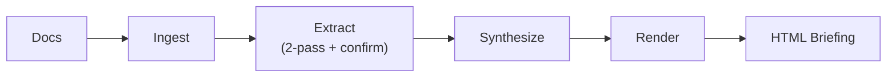
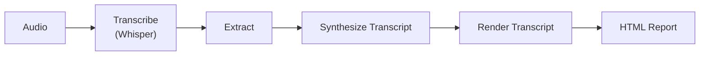

# synthesis

> Point it at a folder of docs for a self-contained HTML briefing, or transcribe a lecture live into a structured report.


synthesis reads your documents (or live audio), pulls out tasks, deadlines, people, and rules with a two-pass extract plus an independent confirmation pass, and renders a single self-contained HTML file. Document mode gives you a strategic briefing with a TODAY-line timeline. Live mode transcribes a lecture or meeting in memory and produces a structured transcript report. Powered by the Anthropic API and faster-whisper.

## Quickstart

```bash
git clone https://github.com/lambdaf-org/synthesis.git
cd synthesis

# Install dependencies
pip install -r requirements.txt

# Set your API key
export ANTHROPIC_API_KEY=sk-ant-...

# Edit config.yaml with your doc paths (see Config below), then run
python3 src/run.py
```

## Features

- **Two modes, one HTML file.** Document mode builds a strategic briefing. Live mode builds a transcript report. Both render to a self-contained `index.html` with no build step.
- **TODAY-line timeline.** Document briefings render a vertical timeline where a TODAY line separates done from upcoming, with expandable item cards and a game-plan section.
- **Two-pass extraction with confirmation.** Each shard runs a main extract pass, a re-read pass for missed items, and a separate independent confirm pass. Only items both runs agree on survive.
- **Grounded quotes.** Every kept item carries an exact `source_quote` from the document. Items with no grounding are dropped, which keeps hallucinations out.
- **Past-deadline assumption.** Deadlines already passed are treated as done unless the documents say otherwise, so the briefing stays forward-looking.
- **Live transcription in memory.** faster-whisper captures mic or system loopback audio in chunks and feeds an in-memory transcript into the pipeline. No audio is ever written to disk.
- **Swiss German support.** Set `language: de` and seed `initial_prompt` with dialect text to bias the decoder toward Swiss German vocabulary.
- **Credential scrubbing.** The LLM client redacts API keys, tokens, private keys, and high-entropy secrets from context before any request, and retries 429s with exponential backoff.

## Pipelines

**Document mode** points at a folder of docs and produces a strategic HTML briefing:



**Live / Transcript mode** captures a lecture or meeting and produces a structured report:




## How it works

**Document mode** runs `ingest -> extract -> synthesize -> render`.

- **Ingest** walks every configured path. PDFs go through `pdftotext`, DOCX through `pandoc`, CSV and other non-binary text read directly. Prefix a path with `github:user/repo` to shallow-clone and ingest a repo.
- **Extract** shards documents and runs the two-pass plus independent-confirm flow above. Items kept must carry a grounded source quote.
- **Synthesize** asks the model for a structured JSON briefing: status summary, risk level, dated items with urgency and dependencies, a recommended action sequence, blockers, key people, and key rules.
- **Render** turns that JSON into a self-contained HTML file with the TODAY-line timeline, expandable cards, a game plan, and a collapsible context drawer. Open it in any browser.

**Live mode** runs `transcribe -> extract -> synthesize_transcript -> render_transcript`, producing a transcript report with a summary, topic cards, key claims, speakers, takeaways, and a collapsible full transcript. The transcript report is oriented around what was said.

## Config

```yaml
api_key_env: ANTHROPIC_API_KEY
model: claude-sonnet-4-20250514
shard_size: 75000

topics:
  - name: My Project
    paths:
      - /path/to/docs
      - github:user/repo
```

Each topic gets its own section in the briefing, processed independently. Add as many as you want.

## Run

| Command | What it does |
|---|---|
| `python3 src/run.py` | Generate briefing and serve |
| `python3 src/run.py --generate` | Generate only |
| `python3 src/run.py --serve` | Serve existing `index.html` on the configured host and port (default `8899`) |
| `python3 src/run.py --live` | Live mic transcription, then report, then serve |
| `python3 src/run.py --live-teams` | System audio loopback (Teams/Zoom/Meet), then report, then serve |

<details>
<summary><strong>Live transcription: setup, platform support, config</strong></summary>

The live deps (faster-whisper, sounddevice, numpy) ship in `requirements.txt`. You also need PortAudio at the system level:

```bash
# macOS
brew install portaudio

# Debian / Ubuntu
sudo apt install libportaudio2
```

`--live` opens the microphone, transcribes in real time with [faster-whisper](https://github.com/SYSTRAN/faster-whisper), and feeds the result into `extract -> synthesize_transcript -> render_transcript`. On first run, faster-whisper downloads the `large-v3` model (~3 GB) and caches it for later runs. No audio files are ever written to disk.

`--live-teams` captures whatever audio your system is currently playing, so it picks up the lecturer's voice straight from Teams, Zoom, or any app with no manual device selection.

| Mode | Command | Audio source |
|---|---|---|
| In-person lecture | `python3 src/run.py --live` | Microphone |
| Teams / Zoom / Meet | `python3 src/run.py --live-teams` | System audio output (loopback) |

### Platform support for loopback

| OS | How it works | Setup required |
|---|---|---|
| **Windows** | WASAPI loopback on the default output device | None, works out of the box |
| **Linux** | PulseAudio/PipeWire monitor source (auto-detected) | None, works out of the box |
| **macOS** | Scans for BlackHole or a similar virtual audio cable | `brew install blackhole-2ch` (one time) |

**macOS one-time setup:**

1. `brew install blackhole-2ch`
2. Open Audio MIDI Setup (Spotlight, "Audio MIDI Setup")
3. Click +, Create Multi-Output Device, check both your speakers and BlackHole 2ch
4. Set the Multi-Output Device as your system output in System Settings, Sound
5. Run `python3 src/run.py --live-teams`. BlackHole is auto-detected, no config needed.

The code scans audio devices for names containing "blackhole", "loopback", or "virtual" on macOS, and "monitor" on Linux, so no device flag or config entry is ever required.

**Live config** (`config.yaml`):

```yaml
live:
  language: de              # BCP-47 language code; "de" covers Standard and Swiss German
  initial_prompt: "Grüezi, hüt bespräche mer d'Vorlesig..."  # seeds the decoder with dialect vocabulary
  model_size: large-v3      # whisper model to use
  chunk_seconds: 15         # transcribe every N seconds of captured audio
  topic_name: "Live Lecture" # name used in the generated report
```

**Swiss German:** faster-whisper uses `language: de` for all German variants. Seeding `initial_prompt` with Swiss German text (e.g. `"Grüezi, hüt bespräche mer..."`) biases the model toward dialect vocabulary and spelling.

**Privacy:** no audio is ever saved to disk. Everything is processed in memory and discarded once the transcript is produced.

</details>

<details>
<summary><strong>Cost</strong></summary>

Each topic with N document shards makes roughly 3N + 1 API calls: every shard goes through extract, re-extract, and confirm, plus one synthesize call at the end. On Anthropic API Tier 1 you have 8k output tokens per minute, so `extract.py` keeps `workers = 1` to stay under the limit. The retry logic in `llm.py` handles 429s with exponential backoff.

</details>

## Files

```
src/run.py         orchestrator
src/ingest.py      file walker and text extraction
src/extract.py     two-pass LLM extraction with confirmation
src/synthesize.py  synthesize() for briefings; synthesize_transcript() for transcript reports
src/render.py      render() for briefings; render_transcript() for transcript reports
src/llm.py         API client with credential scrubbing and retry
src/transcribe.py  real-time Whisper mic and loopback transcription
config.yaml        paths and settings
```

## Contributing

Lambdaforge is open source and contributions are welcome. Start with the [contributor guide](https://github.com/lambdaf-org/contributing), and see the org-wide [CONTRIBUTING](https://github.com/lambdaf-org/.github/blob/main/CONTRIBUTING.md) and [Code of Conduct](https://github.com/lambdaf-org/.github/blob/main/CODE_OF_CONDUCT.md).

## License

This repository does not yet include a `LICENSE` file, so default copyright applies for now. A license is coming soon. If you want to use or build on this before then, please open an issue.
